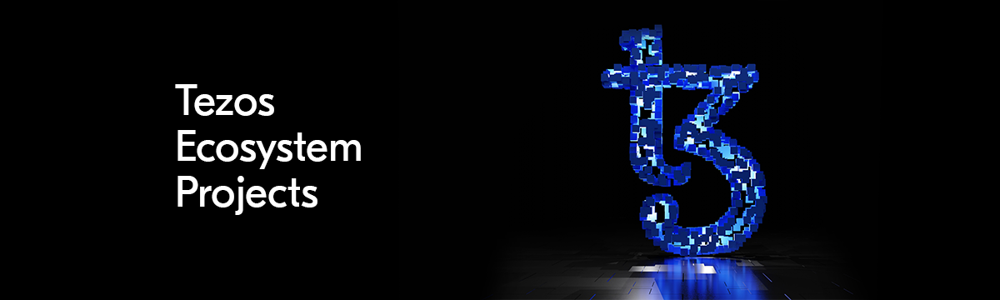

This repository serves as the source for the Tezos Ecosystem page at https://tezos.com/ecosystem.

*Note: This page and the submission process is currently in beta. While it is possible to submit projects for listing consideration currently, final Application Criteria for listing is expected to be live in early Q2 2022, at which point the submission and listing process will become fully active.*

# Contributions

Each project must include two files: a Markdown document and a logo. In order to add a new project, please:

1) Create a new Markdown file with all project information (see below) in the `projects` folder.
2) Add an image into the `logos` folder.
3) Submit a pull request to the main branch for review.

If you need to update your project information and logo, please simply update your existing Markdown file (be sure to update the date) and submit a new PR.


## Example
```
---
slug: "projectname"
date: "2022-1-20"
project: "Project Name"
logline: "A short one-sentence description of your project."
logo: "projectname.svg"
tags: "defi"
status: "active"
website: "https://[project-url]"
twitter: "https://twitter.com/[project-name]"
---

A fuller description of your project can be inserted here: think one to two paragraphs. 
```

A `template.md` file has been provided for your convenience at the root of the project. You may copy and fill in with your information.

The following are the optional and required fields in the Markdown frontmatter:

- **(required)** `slug`: Page url for your project at tezos.com/ecosystem/slug
- **(required)** `date`: Date of project addition or most recent update
- **(required)** `project`: Name of your project
- **(required)** `logline`: One-sentence project description
- **(required)** `logo`: Name and file extension of your project's logo (should match what you add to the `logos` folder)
- **(required)** `tags`: Comma-separated list of zero, one, or more tags that apply to your project. Please include only tags from the list below.
- **(required)** `status`: One of the following: `under construction`, `active`, or `inactive`
- **(required)** `website`: Project website URL, including HTTP/HTTPS (required)
- **(optional)** `twitter`: Project Twitter URL, including HTTP/HTTPS (optional)

*Note: If any of your text in the above fields includes an escape character, please unescape.*

If you are not including a Twitter URL, simply leave the field blank.

Please include a one to two paragraph description below the three dashes – these descriptions will be featured on your dedicated project page. 

## Tags

The following are the currently available project tags:

```
blockexplorers
baking
community
defi
devtools
nft
gaming
did
stablecoins
```

Please use only these tags and watch out for typos. Excluding tags is also an option. 

## Logos

All images should be roughly 500x500px. .svg is strongly preferred but other options include .png, .jpg, and .jpeg. These logos will not only appear in the cards on tezos.com/ecosystem but also much larger on each individual project's page, so size accordingly.
